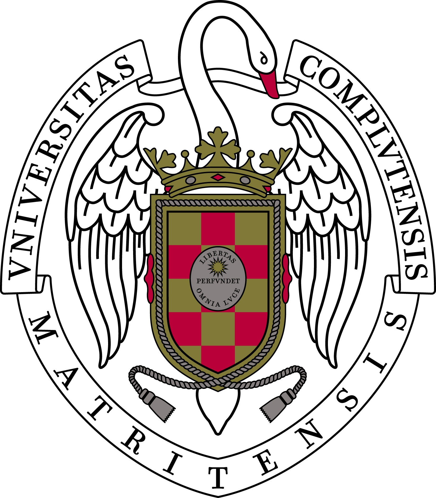
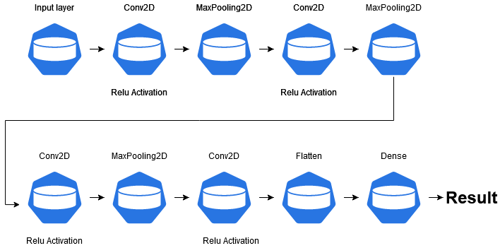

## Inference time optimization on a machine learning model using OpenVINO and deployment of the model in a cloud environment.

  

Remote observation of the Earth has always been a point of interest to humans. Over the years, the methods used for this purpose have evolved until, at present, the analysis of multispectral images constitutes a very active line of research, in particular to carry out fire monitoring and follow-up, natural disasters, chemical spills or other types of environmental pollution. Satellite imagery in a world where machine learning and data processing has advanced so far opens up the possibility of building real-time processing models witch’s recognizes areas where a natural disaster has occurred, and being able to act accordingly. This Final Degree Project carry out the optimization of a machine learning model used to detect natural disasters with the Intel OpenVINO toolkit. In addition, the application is deployed in a Google cloud environment, with the objective of support thousands requests per minute.

## About
This code repository contains the source code used to develop a tool to train & use a neural network capable of 
predict natural disasters using satellite images.
Besides that, one of the main objectives of the project is to optimize the inference time using a low level layer included in the intel openvino tool.

  

Finally, the model is exposed using a web framework that includes the inference engine.
The application was deployed in Google Cloud Platform following the following architecture 

  

## Tools
- Docker
- Docker-compose
- TensorFlow
- OpenVino
- Flask
- FastAPI
- Google Cloud platform
- Latex

# Official link
https://eprints.ucm.es/id/eprint/62126/